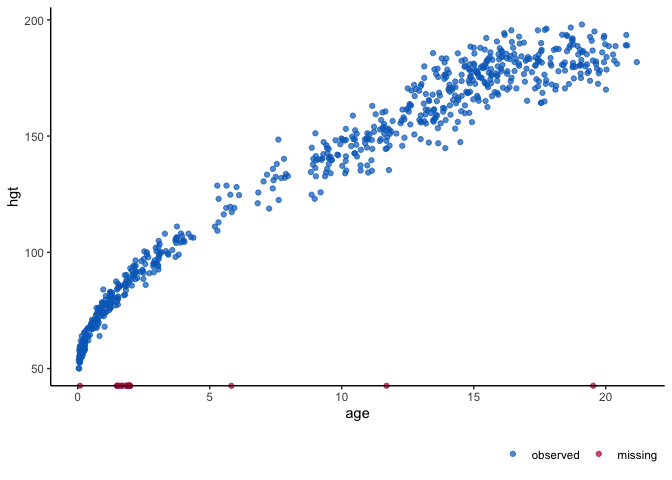

<!-- README.md is generated from README.Rmd. Please edit that file and render with devtools::build_readme() -->

# `ggmice` <a href='https://amices.github.io/ggmice/'></a>

<!-- badges: start -->

[](https://github.com/amices/ggmice/actions)
[](https://github.com/amices/ggmice/blob/main/DESCRIPTION)
[](https://www.gnu.org/licenses/gpl-3.0.en.html)
[](https://lifecycle.r-lib.org/articles/stages.html#experimental)
<!-- badges: end -->

## Plotting package for incomplete and imputed data

`ggmice` is an `R` package which enhances the imputation package `mice`
with `ggplot2` visualizations. See the `ggmice` vignette for an overview
of functionalities.

## Installation

You can install the development version of `ggmice` from
[GitHub](https://github.com/) with:

``` r
# install.packages("devtools")
devtools::install_github("amices/ggmice")
```

## Example

Visualize missing data in an incomplete dataset, or evaluate imputed
data against the observed data.

``` r
library(ggmice)
dat <- mice::boys
ggmice(dat, ggplot2::aes(age, bmi)) + ggplot2::geom_point()
```



``` r
imp <- mice::mice(dat, m = 1, printFlag = FALSE)
ggmice(imp, ggplot2::aes(age, bmi)) + ggplot2::geom_point() 
```


