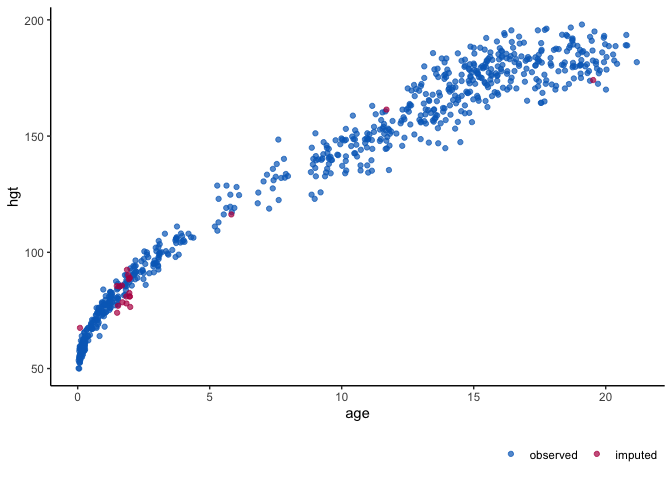

<!-- README.md is generated from README.Rmd. Please edit that file and render with devtools::build_readme() -->

# `ggmice` <a href='https://amices.org/ggmice/'></a>

<!-- badges: start -->

[](https://cran.r-project.org/package=ggmice)
[](https://cranlogs.r-pkg.org/badges/grand-total/ggmice)
[](https://doi.org/10.5281/zenodo.6532702)

[](https://github.com/amices/ggmice/blob/main/DESCRIPTION)
[](https://lifecycle.r-lib.org/articles/stages.html#experimental)
[](https://github.com/amices/ggmice/actions)
<!-- badges: end -->

## Visualizations for `mice` with `ggplot2`

Enhance a [`mice`](https://amices.org/mice/) imputation workflow with
visualizations for incomplete and/or imputed data. The `ggmice`
functions produce
[`ggplot`](https://ggplot2.tidyverse.org/reference/ggplot) objects which
may be easily manipulated or extended. Use `ggmice` to inspect missing
data, develop imputation models, evaluate algorithmic convergence, or
compare observed versus imputed data.

## Installation

You can install the latest `ggmice` release from
[CRAN](https://CRAN.R-project.org/package=ggmice) with:

``` r
install.packages("ggmice")
```

Alternatively, you could install the development version of `ggmice`
from [GitHub](https://github.com/amices) with:

``` r
# install.packages("devtools")
devtools::install_github("amices/ggmice")
```

## Example

Inspect the missing data in an incomplete dataset and subsequently
evaluate the imputed data points against observed data. See the [Get
started](https://amices.org/ggmice/articles/ggmice.html) vignette for an
overview of all functionalities. Example data from
[`mice`](https://amices.org/mice/reference/boys), showing height (in cm)
by age (in years).

``` r
# load packages
library(ggplot2)
library(mice)
library(ggmice)
# load some data
dat <- boys
# visualize the incomplete data
ggmice(dat, aes(age, hgt)) + geom_point()
```


``` r
# impute the incomplete data
imp <- mice(dat, m = 1, seed = 1)
# visualize the imputed data
ggmice(imp, aes(age, hgt)) + geom_point()
```



## Acknowledgements

The `ggmice` package is developed with guidance and feedback from the
[Amices](https://github.com/amices) team. The `ggmice` hex is based on
the [`ggplot2`](https://github.com/tidyverse/ggplot2/) and
[`mice`](https://github.com/amices/mice) hex designs.

This project has received funding from the European Union’s Horizon 2020
research and innovation programme under ReCoDID grant agreement No
825746.

## Contributors

<!-- ALL-CONTRIBUTORS-LIST:START - Do not remove or modify this section -->
<!-- prettier-ignore-start -->
<!-- markdownlint-disable -->
<!-- markdownlint-restore -->
<!-- prettier-ignore-end -->
<!-- ALL-CONTRIBUTORS-LIST:END -->

## Code of Conduct

You are invited to join the improvement and development of `ggmice`.
Please note that the project is released with a [Contributor Code of
Conduct](https://amices.org/ggmice/CODE_OF_CONDUCT.html). By
contributing to this project, you agree to abide by its terms.

[](https://www.gnu.org/licenses/gpl-3.0.en.html)
[](https://app.codecov.io/gh/amices/ggmice?branch=main)
[](https://bestpractices.coreinfrastructure.org/projects/6036)
[](https://fair-software.eu)
