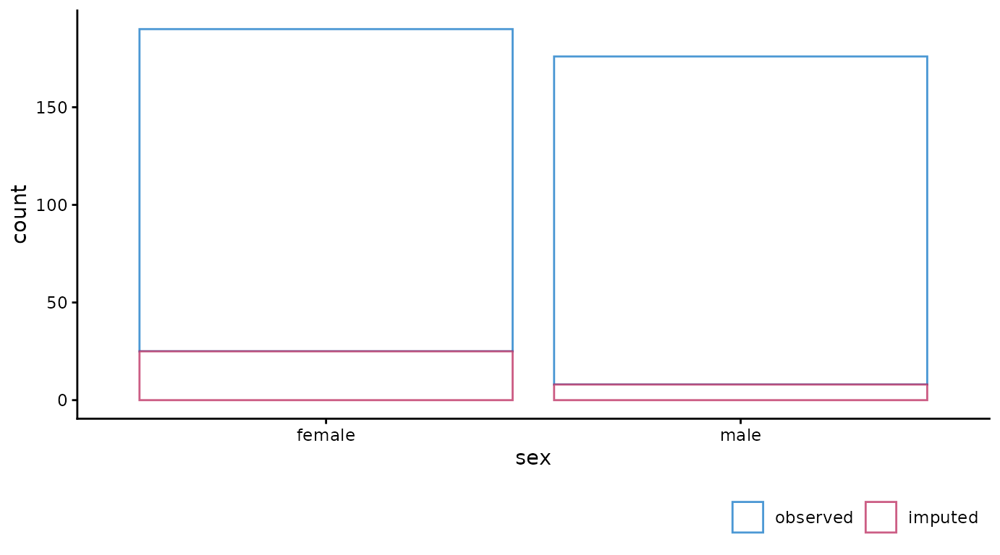
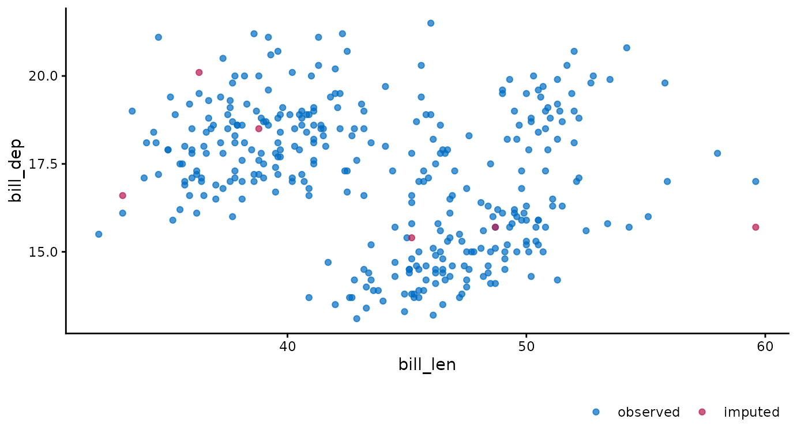
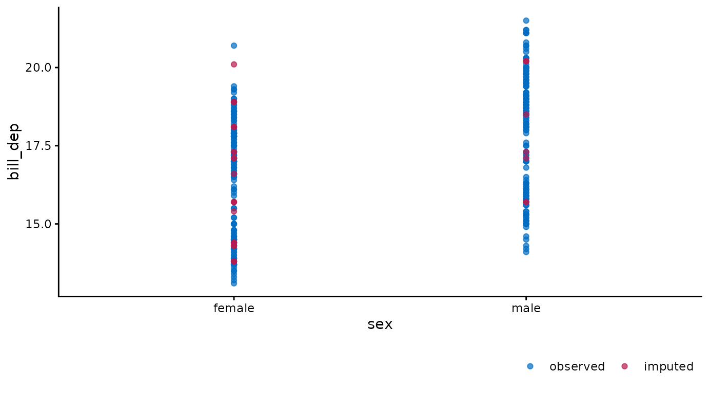
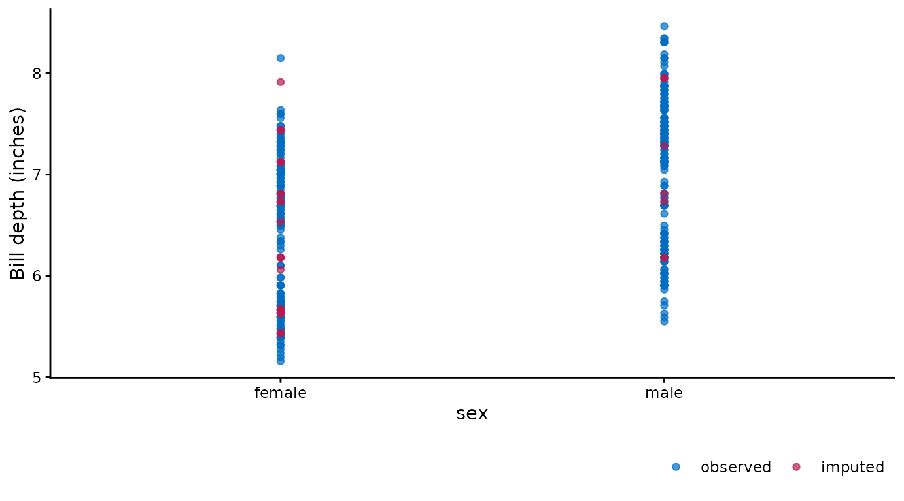
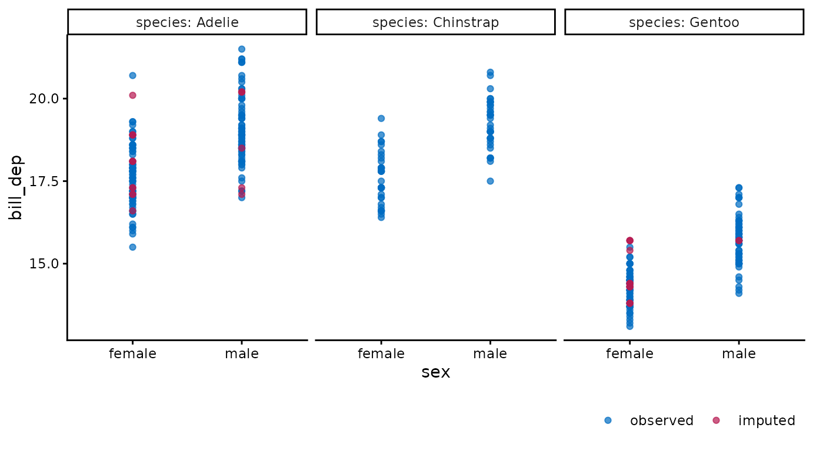
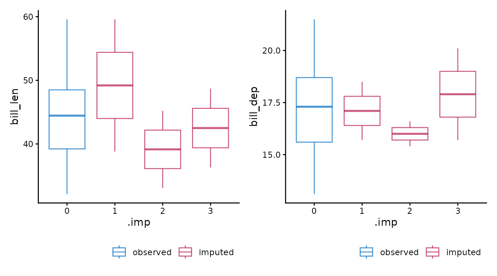
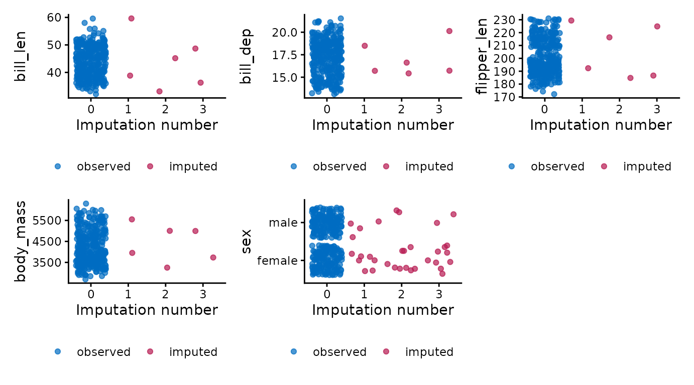

# Get started with \`ggmice\`

The R package `ggmice` supports `mice` imputation workflows with
visualizations. `ggmice` provides ‘grammar of graphics’ (`ggplot2`)
functionality for exploring incomplete data, building imputation models,
and evaluating imputations.

The core function,
[`ggmice()`](http://amices.org/ggmice/reference/ggmice.md), is designed
to highlight missing and imputed observations, instead of omitting these
from graphs. The resulting visualizations either contain observed and
*missing* data, or observed and *imputed* data, allowing for direct
graphical comparisons between incomplete and imputed data.

### Minimal example

Set-up the environment in R with packages for imputation and
visualization.

``` r

library(mice) 
library(ggplot2)
library(ggmice)
```

Visualize some incomplete data with
[`ggmice()`](http://amices.org/ggmice/reference/ggmice.md). We use the
`penguins` data from the base R `datasets`, with observational data on
penguins ($`n = 344`$) with $`8`$ variables (e.g., penguin species and
body mass measurements).

``` r

ggmice(penguins, aes(sex, body_mass)) + 
    geom_point()
```


Visualization of the incomplete `penguins` dataset, displaying penguin’s
body mass measurements (in grams) by their assigned sex classification.
Complete cases are displayed in blue and incomplete cases in red. The
missing values are plotted on the axes lines, showing that some cases
have observed data for body mass and missing sex classification, and at
least one case has neither observed. The observed `body_mass` data of
cases with missing `sex` are plotted on the vertical axis.

Impute the missing values in the `penguins` data set with `mice`.

``` r

imp <- mice(penguins, print = FALSE)
```

Visualize the imputed `penguins` data set with `ggmice`.

``` r

ggmice(imp, aes(sex, body_mass)) + 
    geom_point()
```


Visualization of the `penguins` dataset, showing body mass measurements
(in grams) and sex classification after multiply imputing the missing
values with `mice`. Imputed values are displayed in red.

The [`ggmice()`](http://amices.org/ggmice/reference/ggmice.md)
visualizations may be used to inspect the incomplete and imputed data,
and to evaluate imputation model fit (e.g., whether the missing data
have been imputed within the range of the observed data). Aside from the
[`ggmice()`](http://amices.org/ggmice/reference/ggmice.md) function, the
package contains several other visualization tools for imputation with
`mice`. These other functions share the naming convention `plot_*()` and
several function arguments (e.g., `vrb` to plot only a subset of
variables).

In this vignette, you will learn how to create and interpret `ggmice`
visualizations for each phase of your imputation workflow. But first, we
need some background information about the `ggmice` package and its core
function, [`ggmice()`](http://amices.org/ggmice/reference/ggmice.md).

### The `ggmice` package

The `ggmice` package unifies the visualization of incomplete and imputed
data, and offers tools for building and evaluating imputation models in
R ([R Core Team 2025](#ref-rcoreteam2025)). `ggmice` is an extension
package to the popular R packages `mice` ([van Buuren and
Groothuis-Oudshoorn 2011](#ref-vanbuuren2011)) and `ggplot2` ([Wickham
2016](#ref-wickham2016)).

`mice` has become standard software for handling the ubiquitous problem
of incomplete data. With `mice`, missing data points are ‘imputed’
(i.e., filled in) to obtain several completed data sets. Filling in the
missing data multiple times allows for a valid representation of the
uncertainty due to missingness. `ggmice` supports `mice` workflows with
graphical evaluation tools.

The `ggmice` package also extends `ggplot2`, by offering functionality
for the visualization of missing and imputed values. The functions in
`ggmice` adhere to `ggplot2`‘s ’grammar of graphics’ philosophy. The
resulting plots are standard `ggplot` objects, which means you can add
layers, labels, themes, facets, and transformations as usual. Moreover,
these editable `ggplot` objects are easily adapted into
publication-quality graphics.

### The `ggmice()` function

The core function in the `ggmice` package is
[`ggmice()`](http://amices.org/ggmice/reference/ggmice.md).
[`ggmice()`](http://amices.org/ggmice/reference/ggmice.md) is a
[`ggplot2::ggplot()`](https://ggplot2.tidyverse.org/reference/ggplot.html)
wrapper function, which plots either missing or imputed values.

- When the `data` argument is supplied with an incomplete dataset (a
  `data.frame` object),
  [`ggmice()`](http://amices.org/ggmice/reference/ggmice.md) visualizes
  observed and *missing* data.
- When the `data` argument is supplied with multiply imputed datasets (a
  `mids` object),
  [`ggmice()`](http://amices.org/ggmice/reference/ggmice.md) visualizes
  observed and *imputed* data.

The [`ggmice()`](http://amices.org/ggmice/reference/ggmice.md) function
mimics how the `ggplot2` function
[`ggplot()`](https://ggplot2.tidyverse.org/reference/ggplot.html) works.
Both take a `data` argument and a `mapping` argument, and will return an
object of class `ggplot`.

Using [`ggmice()`](http://amices.org/ggmice/reference/ggmice.md) looks
equivalent to a
[`ggplot()`](https://ggplot2.tidyverse.org/reference/ggplot.html) call:

``` r

ggplot(penguins, aes(x = body_mass))
ggmice(penguins, aes(x = body_mass))
```

The main difference between the two functions is that
[`ggmice()`](http://amices.org/ggmice/reference/ggmice.md) includes some
pre-processing steps for incomplete and imputed data. The functions can
be used interchangeably, except for two key details:

1.  The object supplied to the `data` argument in
    [`ggmice()`](http://amices.org/ggmice/reference/ggmice.md) may be
    either an incomplete dataset of class `data.frame`, or an imputation
    object of class
    [`mice::mids`](https://amices.org/mice/reference/mids.html).

2.  The `mapping` argument in
    [`ggmice()`](http://amices.org/ggmice/reference/ggmice.md) cannot be
    empty.

This is in contrast to the aesthetic mapping in
[`ggplot()`](https://ggplot2.tidyverse.org/reference/ggplot.html), which
may also be provided in subsequent plotting layers. Because of the
internal processing in
[`ggmice()`](http://amices.org/ggmice/reference/ggmice.md), the
`mapping` argument is **required** for each
[`ggmice()`](http://amices.org/ggmice/reference/ggmice.md) call. An `x`
or `y` mapping (or both) has to be supplied for
[`ggmice()`](http://amices.org/ggmice/reference/ggmice.md) to function.
This aesthetic mapping can be provided with the `ggplot2` function
[`aes()`](https://ggplot2.tidyverse.org/reference/aes.html) (or
equivalents). Other mappings may be provided too, except for `colour`,
which is already used to display observed versus missing or imputed
data.

After creating a `ggplot` object, any desired plotting layers may be
added (e.g., with the family of `ggplot2::geom_*` functions), or
adjusted (e.g., with the
[`ggplot2::labs()`](https://ggplot2.tidyverse.org/reference/labs.html)
function). This makes
[`ggmice()`](http://amices.org/ggmice/reference/ggmice.md) a versatile
plotting function for incomplete and imputed data.

#### Incomplete data

If the object supplied to the `data` argument in the
[`ggmice()`](http://amices.org/ggmice/reference/ggmice.md) function is a
`data.frame`, the visualization will contain observed data in blue and
missing data in red.

Because missing data points are by definition unobserved, their values
cannot be plotted directly. While for categorical variables we can
display the missing values as their own category, there is no
straightforward way to show the missingness in continuous variables.
Therefore, we typically omit incomplete observations from our graphs.

In bivariate graphs, however, we can display incomplete observations in
variable pairs. When there is a missing datapoint on one variable and
observed data on the other, there is no bivariate coordinate in the
graph to display this incomplete observation. But we can still plot the
information that we do have: the observed datapoint. These incomplete
observations are plotted on the axes lines:

- Cases with observed `X` and missing `Y` are plotted on the horizontal
  axis.
- Cases with observed `Y` and missing `X` are plotted on the vertical
  axis.
- Cases with both `X` and `Y` missing are plotted on the intersection of
  the two axes, since no data is available.

These plotted values are observed for the variable belonging to that
axis line, but not for the variable orthogonal to the axis line. This
provides a visual cue that the missing data is distinct from the
observed values, but still displays the observed value of the other
variable. In short,
[`ggmice()`](http://amices.org/ggmice/reference/ggmice.md) plots the
observed values of incomplete cases on the axis line of the observed
variable. This is in contrast to a regular
[`ggplot()`](https://ggplot2.tidyverse.org/reference/ggplot.html) call
with the same arguments, which would leave out all cases with
missingness.

#### Imputed data

If the `data` argument in
[`ggmice()`](http://amices.org/ggmice/reference/ggmice.md) is provided a
[`mice::mids`](https://amices.org/mice/reference/mids.html) object, the
resulting plot will contain observed data in blue and imputed data in
red.

Experienced `mice` users may already be familiar with the `lattice`
style plotting functions in `mice` for visualizing imputed data. These
‘old friends’ such as
[`mice::stripplot()`](https://rdrr.io/pkg/lattice/man/xyplot.html) can
be re-created with the
[`ggmice()`](http://amices.org/ggmice/reference/ggmice.md) function, see
the [Old friends](https://amices.org/ggmice/articles/old_friends.html)
vignette for advice.

So, with [`ggmice()`](http://amices.org/ggmice/reference/ggmice.md) we
lose less information, and may gain valuable insight into the
missingness in the data.

## Imputation workflow

In this vignette, the `ggmice` functions are presented in the order of a
typical imputation workflow, where the missingness is first
investigated, then imputation models are built based on relations
between variables, and finally the imputations are inspected visually.

### Set-up

You can install the latest `ggmice` release from
[CRAN](https://CRAN.R-project.org/package=ggmice) with:

``` r

install.packages("ggmice")
```

The development version of the `ggmice` package can be installed from
GitHub with:

``` r

# install.packages("pak")
pak::pak("amices/ggmice")
```

After installing `ggmice`, you can load the package into your `R`
workspace. It is highly recommended to load the `mice` and `ggplot2`
packages as well. This vignette assumes that all three packages are
loaded:

``` r

library(mice)
library(ggplot2)
library(ggmice)
```

We will use the `penguins` data for illustrations, available from the
base R `datasets`. The `penguins` dataset contains incomplete
observational data on penguin sightings ($`n = 344`$). Each row
represents an individual penguin, and the nine variables describe its
characteristics (e.g., species) and measurements (e.g., body weight in
grams).

``` r

head(penguins)
#>   species    island bill_len bill_dep flipper_len body_mass    sex year
#> 1  Adelie Torgersen     39.1     18.7         181      3750   male 2007
#> 2  Adelie Torgersen     39.5     17.4         186      3800 female 2007
#> 3  Adelie Torgersen     40.3     18.0         195      3250 female 2007
#> 4  Adelie Torgersen       NA       NA          NA        NA   <NA> 2007
#> 5  Adelie Torgersen     36.7     19.3         193      3450 female 2007
#> 6  Adelie Torgersen     39.3     20.6         190      3650   male 2007
```

In this vignette, we will treat the penguins data as our working
example.

With that, we have the necessary packages (`mice`, `ggplot2`, and
`ggmice`) and an incomplete dataset (`penguins`) to start the full
imputation workflow. We will first use `ggmice` to explore marginal and
joint distributions of incomplete variables. Next, we will construct and
inspect imputation models based on relations between the variables.
Finally, we will visualize the imputation algorithm output and assess
whether the imputation models yield plausible values.

## Exploring incomplete data

In a `mice` workflow, the missing data should first be inspected before
determining an imputation strategy. The missing data pattern shows where
in the incomplete data the missing values occur. Multivariate graphs may
highlight the severity of the missing data problem in the variables that
will be used in the eventual analysis model.

### `plot_miss()`

The [`plot_miss()`](http://amices.org/ggmice/reference/plot_miss.md)
function facilitates the exploration of the location of the missingness
in the data. The result is the graphical equivalent to the missingness
matrix `is.na(penguins)`.

``` r

plot_miss(penguins)
```


Visualization of the missing data matrix.

The plot can be ordered by the missingness proportion. In the ordered
graph, cases with more missing values are plotted last, matching the
order of the missing data pattern plot
([`plot_pattern()`](http://amices.org/ggmice/reference/plot_pattern.md)).

``` r

plot_miss(penguins, ordered = TRUE)
```


Visualization of the missing data matrix, ordered by the missingness
proportion.

Other optional function arguments can be specified too (e.g., `rotate`
to display the column names at a 90 degree angle). Please refer to the
function documentation for details.

### `plot_pattern()`

The
[`plot_pattern()`](http://amices.org/ggmice/reference/plot_pattern.md)
function displays the missing data pattern in an incomplete dataset,
which should be supplied via the `data` argument.

``` r

plot_pattern(penguins)
```


Missing data pattern plot.

The
[`plot_pattern()`](http://amices.org/ggmice/reference/plot_pattern.md)
function has several optional arguments, such as `square`, which
determines whether the missing data pattern plot has the default square
or rectangular tiles. Please refer to the function documentation for
details.

### `ggmice()`

In the missing data exploration phase, the
[`ggmice()`](http://amices.org/ggmice/reference/ggmice.md) function can
be used to visualize the distributions of incomplete variables,
associations with other variables, and with missingness indicators.

For example, we can plot the distribution of an incomplete categorical
variable with:

``` r

ggmice(penguins, aes(x = sex)) +
  geom_bar(fill = " white")
```


Bar graph showing the distribution of and missingess in the variable
`sex`.

In this graph, the missing data is plotted as a separate category.

We can also plot bivariate distributions in the incomplete data. To
create a scatterplot of two continuous incomplete variables we can use:

``` r

ggmice(penguins, aes(x = bill_len, y = bill_dep)) +
  geom_point()
```


Scatterplot of the `penguins` bill depth (in cm) by bill length (in cm),
showing missing values on the axis lines. The red point at the
intersection of the axes indicates that at least one penguin has neither
bill depth nor bill length observed.

Another bivariate graph can be made with the incomplete continuous
variable `bill_dep` against the incomplete categorical variable `sex`:

``` r

ggmice(penguins, aes(x = sex, y = bill_dep)) +
  geom_point()
```


Visualization of bill depth (in cm) by sex, showing missing values in
red on the axis lines. Observed values for bill depth with missing data
for sex are plotted on the vertical axis. The red point at the
intersection of the axes indicates that at least one penguin has neither
bill depth nor sex observed.

The ‘grammar of graphics’ makes it easy to adjust the plots
programmatically. The `ggplot2` framework allows us to convert the
plotted values of the variable `bill_dep` from centimeters to inches
with:

``` r

ggmice(penguins, aes(x = sex, y = bill_dep / 2.54)) +
  geom_point() +
  labs(y = "Bill depth (inches)")
```


Visualization of bill depth (in inches) by sex, showing missing values
in red on the axis lines. Observed values for bill depth with missing
data for sex are plotted on the vertical axis. The red point at the
intersection of the axes indicates that at least one penguin has neither
bill depth nor sex observed.

Another benefit of `ggplot` objects is that they may be adjusted using
layers. If we would be interested in the sex differences in bill length
between the penguin species, we can just add facets based on a
clustering variable with:

``` r

ggmice(penguins, aes(x = sex, y = bill_dep)) +
  geom_point() +
  facet_wrap(~ species, labeller = label_both)
```


Visualization of bill depth by sex, split by penguin species. Observed
values for bill depth with missing data for sex are plotted on the
vertical axes. The red point at the intersection of the axes indicates
that at least one penguin has neither bill depth nor sex observed.

## Building imputation models

Imputation with `mice` requires an imputation model for each incomplete
variable, consisting of an imputation method and imputation model
predictors. These methods and predictors are either assigned implicitly
in the [`mice()`](https://amices.org/mice/reference/mice.html) call, or
supplied by the user as a methods vector and predictor matrix. The
defaults in [`mice()`](https://amices.org/mice/reference/mice.html) are
to assign an imputation method based on the column type of each
incomplete variable, and to use all other variables as imputation model
predictors.

The methods vector specifies an imputation method per variable. The
default methods vector can be created using:

``` r

meth <- make.method(penguins)
meth
#>     species      island    bill_len    bill_dep flipper_len   body_mass 
#>          ""          ""       "pmm"       "pmm"       "pmm"       "pmm" 
#>         sex        year 
#>    "logreg"          ""
```

In the default methods vector, imputation methods are based on column
type, e.g., numeric data columns get assigned the semi-parametric
imputation method ‘predictive mean matching’ (`pmm`), whereas
dichotomous variables will be imputed using logistic regression.

The predictor matrix determines which variables will be used as
predictors for imputing the incomplete variables. The default predictor
matrix can be created with:

``` r

pred <- make.predictorMatrix(penguins)
pred
#>             species island bill_len bill_dep flipper_len body_mass sex year
#> species           0      1        1        1           1         1   1    1
#> island            1      0        1        1           1         1   1    1
#> bill_len          1      1        0        1           1         1   1    1
#> bill_dep          1      1        1        0           1         1   1    1
#> flipper_len       1      1        1        1           0         1   1    1
#> body_mass         1      1        1        1           1         0   1    1
#> sex               1      1        1        1           1         1   0    1
#> year              1      1        1        1           1         1   1    0
```

In the predictor matrix, rows represent variables to impute, and columns
are potential imputation model predictors. By default, each variable is
used as imputation model predictor for all other variables.

### `plot_pred()`

The function
[`plot_pred()`](http://amices.org/ggmice/reference/plot_pred.md)
displays `mice` predictor matrices, optionally paired with imputation
methods. To create a predictor matrix plot, supply a predictor matrix
via the `data` argument:

``` r

plot_pred(pred)
```


Predictor matrix with `mice` defaults.

Optional arguments may be added to the function call. For example, to
show the full imputation model per incomplete variable, supply the
methods vector via the optional argument `meth`:

``` r

plot_pred(pred, meth = meth)
```


Predictor matrix with `mice` defaults including imputation methods.

Please refer to the function documentation for details.

### `plot_corr()`

The function
[`plot_corr()`](http://amices.org/ggmice/reference/plot_corr.md) can be
used to investigate relations between variables for the development of
imputation models. The function requires incomplete dataset (via the
argument `data`). All other arguments are optional, for example to add
textual labels of the estimated correlations (via the `label` argument).

``` r

plot_corr(penguins, label = TRUE)
```


Visualization of bivariate correlations.

Based on these correlations, we can evaluate whether we have included
all relevant imputation model predictors in the predictor matrix. With
large datasets, for example, we might want to prune the predictor
matrix, only to include the most relevant imputation model predictors.

The [`quickpred()`](https://amices.org/mice/reference/quickpred.html)
function in `mice` selects imputation model predictors based on
associations in the data. The function calculates correlations both with
pairwise complete observations, as well as with the missingness
indicators. Any potential imputation model predictor that surpasses a
certain set threshold on either one of the two correlations, is selected
into the predictor matrix.

``` r

pred <- quickpred(penguins, mincor = 0.4)
plot_pred(pred, method = meth)
```


Predictor matrix plot after pruning the predictor matrix.

The result is a pruned predictor matrix, that only includes imputation
model predictors with a strong linear associations with the incomplete
variables or missingness indicators.

If we want to visualize this associations between observed data and
missingness indicators, we can use an influx-outflux plot.

### `plot_flux()`

The [`plot_flux()`](http://amices.org/ggmice/reference/plot_flux.md)
function produces an influx-outflux plot. The influx of a variable
quantifies how well its missing data connect to the observed data on
other variables. The outflux of a variable quantifies how well its
observed data connect to the missing data on other variables. In
general, higher influx and outflux values are preferred when building
imputation models.

The plotting function requires an incomplete dataset (argument `data`),
and takes optional arguments to adjust e.g., the legend and axis labels:

``` r

plot_flux(penguins, label = FALSE)
```


Influx-outflux plot, showing connections between observed data and
misisngness indicators. For example, `species`, `island`, and `year`
have high outflux values and low influx, indicating that these observed
variables may be quite informative for imputing incomplete variables.

For details, see the function documentation.

We can use this information to adjust the imputation models, via editing
the predictor matrix. Based on the high outflux values, we add
`species`, `island`, and `year` to the imputation models for all
variables.

``` r

pred[, c("species", "island", "year")] <- 1
```

Subsequently, we can remove any variable that now became an imputation
model predictor for itself:

``` r

diag(pred) <- 0
```

``` r

plot_pred(pred, method = meth)
```


Predictor matrix plot after adding high outflux variables to the
predictor matrix.

Another way to evaluate the associations with the missingness indicators
is using [`ggmice()`](http://amices.org/ggmice/reference/ggmice.md).

### `ggmice()`

We can use [`ggmice()`](http://amices.org/ggmice/reference/ggmice.md) to
visualize associations between observed and missing data, by applying
the function to incomplete data and adding faceting based on a
missingness indicator. This may help further explore the missingness
mechanisms in the incomplete data.

For example, to investigate which variables may be informative for
imputing the incomplete variable `sex`, we can create a graph split by
the missingness indicator of `sex`. To visualize the association between
the distribution of `bill_len` and the missingness indicator of `sex` we
use a faceted design:

``` r

ggmice(penguins, aes(bill_len)) +
  geom_histogram(fill = "white") +
  facet_grid(factor(
    is.na(sex), 
    levels = c(TRUE, FALSE), 
    labels = c("missing sex", "observed sex")
    ) ~ .)
```


Distribution of observed bill length (in cm) split by the missingness
indicator of the variable `sex`. Since the missingness indicator itself
is always observed, this plot does not show any missing data.

We can see there are some differences in the distribution of `bill_len`
based on the missingness indicator of `sex`, which may imply that
`bill_len` is informative for imputing `sex`.

We add this variable to the imputation model of `sex` by assigning
`bill_len` as imputation model predictor in the predictor matrix:

``` r

pred["sex", c("bill_len", "species")] <- 1
```

Since we had already added some imputation model predictors, our
predictor matrix now looks as follows:

``` r

plot_pred(pred, method = meth)
```


Predictor matrix plot after editing the predictor matrix.

This yields a final version of the imputation models, that we will use
to impute the data.

## Evaluating imputations

Run the imputation algorithm on the incomplete dataset, with the
imputation models we built (i.e., the predictor matrix and methods
vector), with three imputations.

``` r

imp <- mice(
  penguins, 
  pred = pred, 
  method = meth, 
  m = 3,
  print = FALSE
)
```

### `plot_trace()`

The function
[`plot_trace()`](http://amices.org/ggmice/reference/plot_trace.md) plots
the trace lines of the MICE algorithm for convergence evaluation. The
only required argument is `data` (to supply a
[`mice::mids`](https://amices.org/mice/reference/mids.html) object).
Optional arguments such as `trend` (to add a trend line that facilitates
interpretation) are described in the function documentation.

``` r

plot_trace(imp, trend = TRUE)
```


Trace plots for all variables.

For algorithmic convergence, the trace plot lines should be stationary
(non-trending) and mixing (intermingling nicely). If we are unsure of
the algorithmic convergence, we can add iterations to the imputation
algorithm and re-evaluate:

``` r

imp <- mice.mids(imp, maxit = 5, print = FALSE)
```

``` r

plot_trace(imp, trend = TRUE)
```


Trace plots for all variables after adding iterations.

We can supplement the inspection of the traceplots with evaluations of
the imputed values themselves. We can use
[`ggmice()`](http://amices.org/ggmice/reference/ggmice.md) to create
visual diagnostics for the imputed variables.

### `ggmice()`

Plotting the imputed data can reveal unrealistic imputations or issues
with the imputation models. Additionally,
[`ggmice()`](http://amices.org/ggmice/reference/ggmice.md) allows for
graphical comparisons between the incomplete and imputed data.

We can create the same plots as the ones on the incomplete data, but now
on the imputed data:

``` r

ggmice(imp, aes(x = sex)) +
  geom_bar(fill = " white")
```



``` r

ggmice(imp, aes(x = bill_len, y = bill_dep)) +
  geom_point()
```



``` r

ggmice(imp, aes(x = sex, y = bill_dep)) +
  geom_point()
```



``` r

ggmice(imp, aes(x = sex, y = bill_dep / 2.54)) +
  geom_point() +
  labs(y = "Bill depth (inches)")
```



``` r

ggmice(imp, aes(x = sex, y = bill_dep)) +
  geom_point() +
  facet_wrap(~ species, labeller = label_both)
```



These figures show the observed data points once in blue, plus 3 imputed
values in red for each missing entry.

In addition to recreating the graphs from the incomplete data
exploration stage, it is also possible to use the imputation number as
mapping variable in the plot. For example, we can create a stripplot of
observed and imputed data with the imputation number `.imp` on the
horizontal axis:

``` r

ggmice(imp, aes(x = .imp, y = bill_len)) +
  geom_jitter(height = 0, width = 0.25) +
  labs(x = "Imputation number")
```


Stripplot of bill length (in cm) by imputation.

A major advantage of
[`ggmice()`](http://amices.org/ggmice/reference/ggmice.md) over the
equivalent function
[`mice::stripplot()`](https://rdrr.io/pkg/lattice/man/xyplot.html) is
that `ggmice` allows us to add subsequent plotting layers, such as a
boxplot overlay:

``` r

ggmice(imp, aes(x = .imp, y = bill_len)) +
  geom_jitter(height = 0, width = 0.25) +
  geom_boxplot(width = 0.5, linewidth = 1, alpha = 0.75, outlier.shape = NA) +
  labs(x = "Imputation number")
```


Stripplot combined with boxplot of bill length (in cm) by imputation.

Another advantage of the ‘grammar of graphics’ philosophy in `ggmice` is
that we can use faceting to split plots by imputation number. This
allows for further inspection of e.g., bivariate distributions within
each imputation:

``` r

ggmice(imp, aes(x = sex, y = bill_dep)) +
  geom_point() +
  facet_wrap(~.imp)
```


Scatterplots split by imputation.

When evaluating imputations, you may want to assess multiple variables
at once. To create plots of multiple imputed variables, we can combine
`ggmice` with the graphical formatting package `patchwork` and the
functional programming package `purrr`.

You can combine figures with `patchworks`’s `wrap_plots()` function:

``` r

p1 <- ggmice(imp, aes(x = .imp, y = bill_len)) + geom_boxplot()
p2 <- ggmice(imp, aes(x = .imp, y = bill_dep)) + geom_boxplot()
patchwork::wrap_plots(p1, p2)
```



Combined boxplots.

And to plot many variables at once, we can use the `purrr` function
`map()` (which works like a vectorized `for` loop). If we want to create
stripplots of every imputed variable–and only imputed variables–we first
need to know which variables were imputed. We generate a vector with the
imputed variable names by extracting all variable names, and then
indexing the variables where the number of imputed values is greater
than zero:

``` r

vrb_names <- names(imp$data)
imp_count <- colSums(imp$where)
vrb_imp <- vrb_names[imp_count > 0]
```

Subsequently, we can use functional programming to create a plot for
each imputed variable:

``` r

plot_list <- purrr::map(vrb_imp, function(vrb){
  ggmice(imp, aes(x = .imp, y = .data[[vrb]])) +
    geom_jitter() +
    labs(x = "Imputation number")
})
```

And finally, we use `patchwork` to combine the plot into one object:

``` r

plot_list |>
  patchwork::wrap_plots()
```



Combined stripplots.

## Take-aways

In this vignette, you have seen how `ggmice` can support each phase of a
`mice` imputation workflow, from the first look at the incomplete data
to evaluating the imputations.

In the exploration of the incomplete data, the
[`ggmice()`](http://amices.org/ggmice/reference/ggmice.md) function
allows you to visualize missing datapoints instead of silently
discarding incomplete cases. Other missingness exploration functions,
such as
[`plot_pattern()`](http://amices.org/ggmice/reference/plot_pattern.md),
may help you understand the structure of the missing data problem and
subsequently inform imputation model choices.

When building imputation models,
[`ggmice()`](http://amices.org/ggmice/reference/ggmice.md) may be used
to investigate associations between the observed data and missingness
indicators. Other visualization functions that may aid imputation model
building are
[`plot_pred()`](http://amices.org/ggmice/reference/plot_pred.md),
[`plot_corr()`](http://amices.org/ggmice/reference/plot_corr.md), and
[`plot_flux()`](http://amices.org/ggmice/reference/plot_flux.md).

Applied to imputed data (`mids` objects),
[`ggmice()`](http://amices.org/ggmice/reference/ggmice.md) visualizes
observed and imputed values together, making it straightforward to
compare the distributions before and after imputation. These graphs may
also flag potential problems in the imputation model fit, such as
implausible imputed values, or algorithmic non-convergence. Algorithmic
convergence is a prerequisite for using `mice` imputations in any
subsequent statistical analysis. Therefore, the
[`plot_trace()`](http://amices.org/ggmice/reference/plot_trace.md)
function offers tools for visually diagnosing non-convergence.

Across these steps, an advantage of `ggmice` is that all visualizations
are standard `ggplot` objects. This means you can adapt them to your own
preferences and publication standards with the usual ‘grammar of
graphics’ functionality.

------------------------------------------------------------------------

## Supporting information

This is the end of the vignette.

This document was generated using:

``` r

sessionInfo()
#> R version 4.6.1 (2026-06-24)
#> Platform: x86_64-pc-linux-gnu
#> Running under: Ubuntu 24.04.4 LTS
#> 
#> Matrix products: default
#> BLAS:   /usr/lib/x86_64-linux-gnu/openblas-pthread/libblas.so.3 
#> LAPACK: /usr/lib/x86_64-linux-gnu/openblas-pthread/libopenblasp-r0.3.26.so;  LAPACK version 3.12.0
#> 
#> locale:
#>  [1] LC_CTYPE=C.UTF-8       LC_NUMERIC=C           LC_TIME=C.UTF-8       
#>  [4] LC_COLLATE=C.UTF-8     LC_MONETARY=C.UTF-8    LC_MESSAGES=C.UTF-8   
#>  [7] LC_PAPER=C.UTF-8       LC_NAME=C              LC_ADDRESS=C          
#> [10] LC_TELEPHONE=C         LC_MEASUREMENT=C.UTF-8 LC_IDENTIFICATION=C   
#> 
#> time zone: UTC
#> tzcode source: system (glibc)
#> 
#> attached base packages:
#> [1] stats     graphics  grDevices utils     datasets  methods   base     
#> 
#> other attached packages:
#> [1] ggmice_0.1.2  ggplot2_4.0.3 mice_3.19.0  
#> 
#> loaded via a namespace (and not attached):
#>  [1] gtable_0.3.6       shape_1.4.6.1      xfun_0.60          bslib_0.12.0      
#>  [5] htmlwidgets_1.6.4  lattice_0.22-9     vctrs_0.7.3        tools_4.6.1       
#>  [9] Rdpack_2.6.6       generics_0.1.4     tibble_3.3.1       pan_2.0           
#> [13] pkgconfig_2.0.3    jomo_2.7-6         Matrix_1.7-5       RColorBrewer_1.1-3
#> [17] S7_0.2.2           desc_1.4.3         lifecycle_1.0.5    compiler_4.6.1    
#> [21] farver_2.1.2       stringr_1.6.0      textshaping_1.0.5  codetools_0.2-20  
#> [25] htmltools_0.5.9    sass_0.4.10        yaml_2.3.12        glmnet_5.0        
#> [29] pillar_1.11.1      pkgdown_2.2.1      nloptr_2.2.1       jquerylib_0.1.4   
#> [33] tidyr_1.3.2        MASS_7.3-65        cachem_1.1.0       reformulas_0.4.4  
#> [37] iterators_1.0.14   rpart_4.1.27       boot_1.3-32        foreach_1.5.2     
#> [41] mitml_0.4-5        nlme_3.1-169       tidyselect_1.2.1   digest_0.6.39     
#> [45] stringi_1.8.9      dplyr_1.2.1        purrr_1.2.2        labeling_0.4.3    
#> [49] splines_4.6.1      fastmap_1.2.0      grid_4.6.1         cli_3.6.6         
#> [53] magrittr_2.0.5     patchwork_1.3.2    survival_3.8-6     broom_1.0.13      
#> [57] withr_3.0.3        scales_1.4.0       backports_1.5.1    rmarkdown_2.31    
#> [61] otel_0.2.0         nnet_7.3-20        lme4_2.0-6         ragg_1.5.2        
#> [65] evaluate_1.0.5     knitr_1.51         rbibutils_2.4.1    mgcv_1.9-4        
#> [69] rlang_1.3.0        Rcpp_1.1.2         glue_1.8.1         minqa_1.2.8       
#> [73] jsonlite_2.0.0     R6_2.6.1           systemfonts_1.3.2  fs_2.1.0
```

### Acknowledgements

The `ggmice` package is developed with guidance and feedback from Gerko
Vink, Stef van Buuren, and others. This project has received funding
from the European Union’s Horizon 2020 research and innovation programme
under ReCoDID grant agreement No 825746.

### References

Buuren, Stef van, and Karin Groothuis-Oudshoorn. 2011. “mice:
Multivariate Imputation by Chained Equations in R.” *Journal of
Statistical Software* 45 (3): 1–67.
<https://doi.org/10.18637/jss.v045.i03>.

R Core Team. 2025. *R: A Language and Environment for Statistical
Computing*. Manual. R Foundation for Statistical Computing.
<https://www.R-project.org/>.

Wickham, Hadley. 2016. *ggplot2: Elegant Graphics for Data Analysis*.
Springer-Verlag New York. <https://ggplot2.tidyverse.org>.
