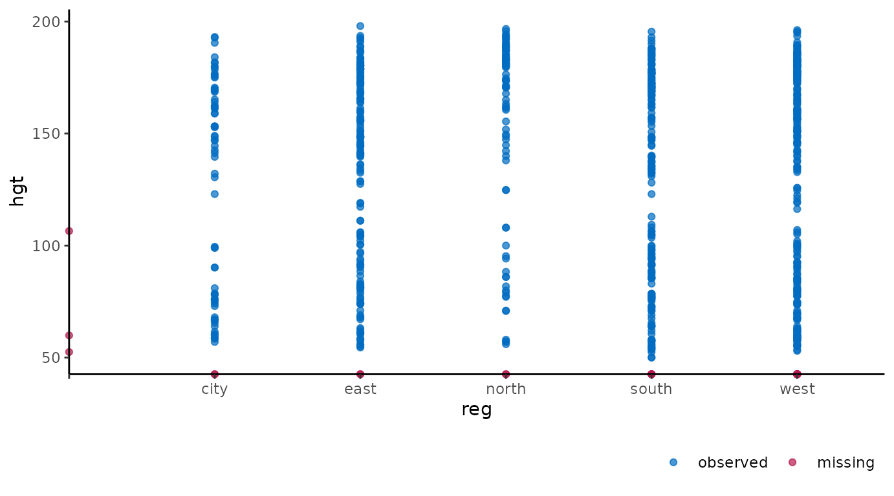
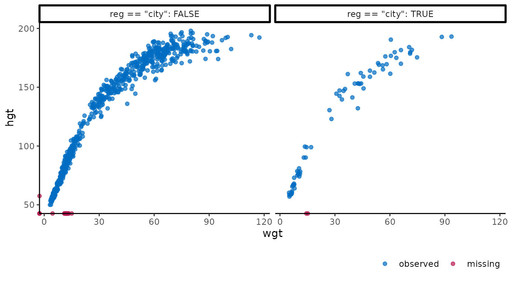
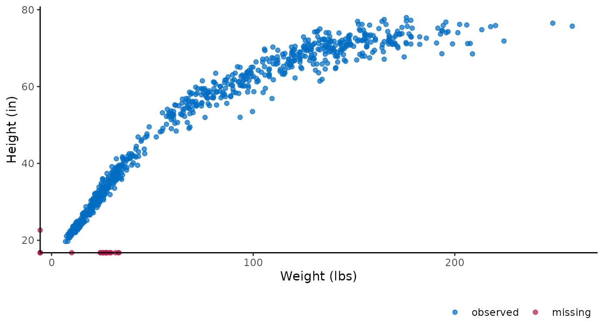
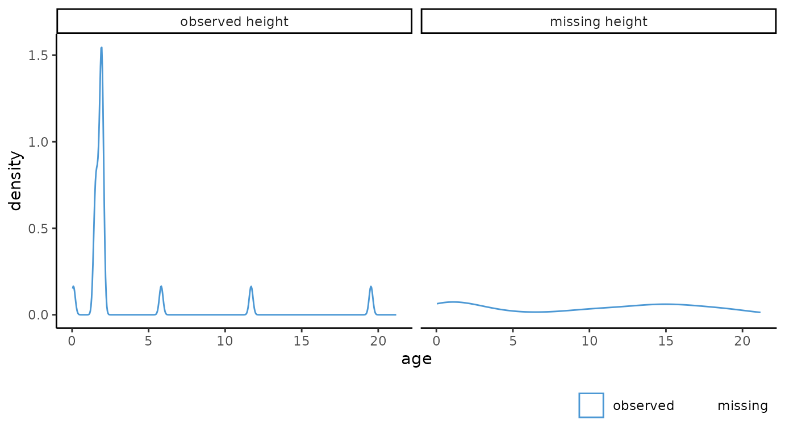
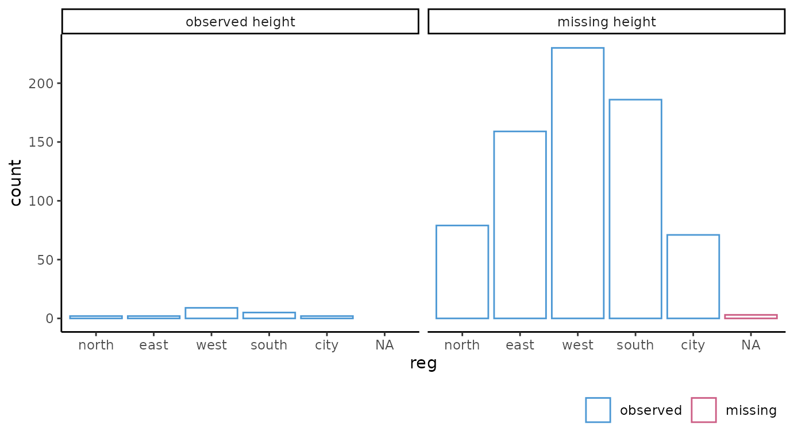
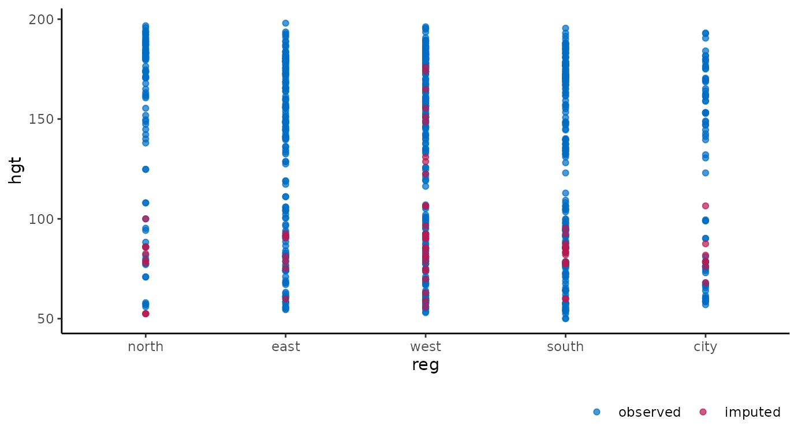
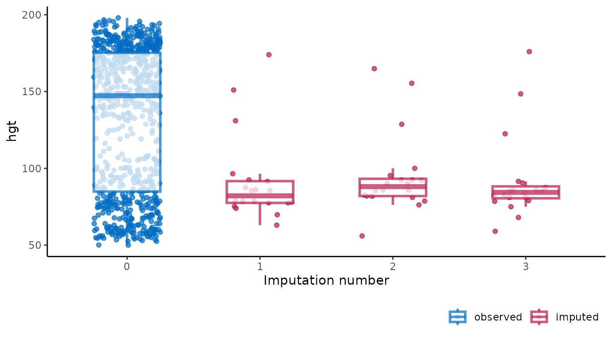
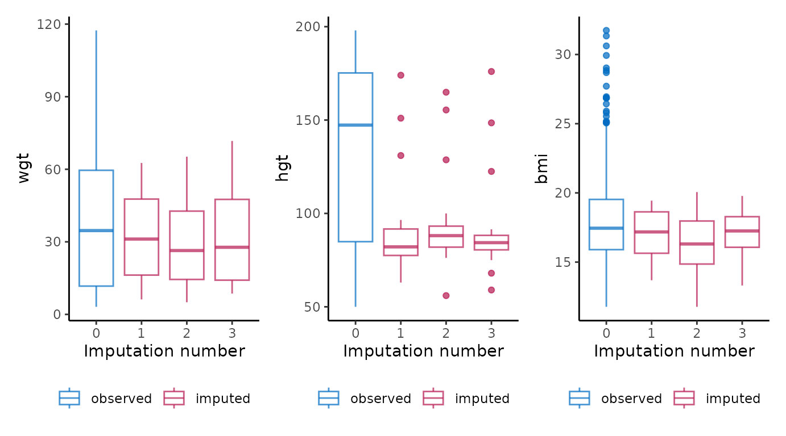
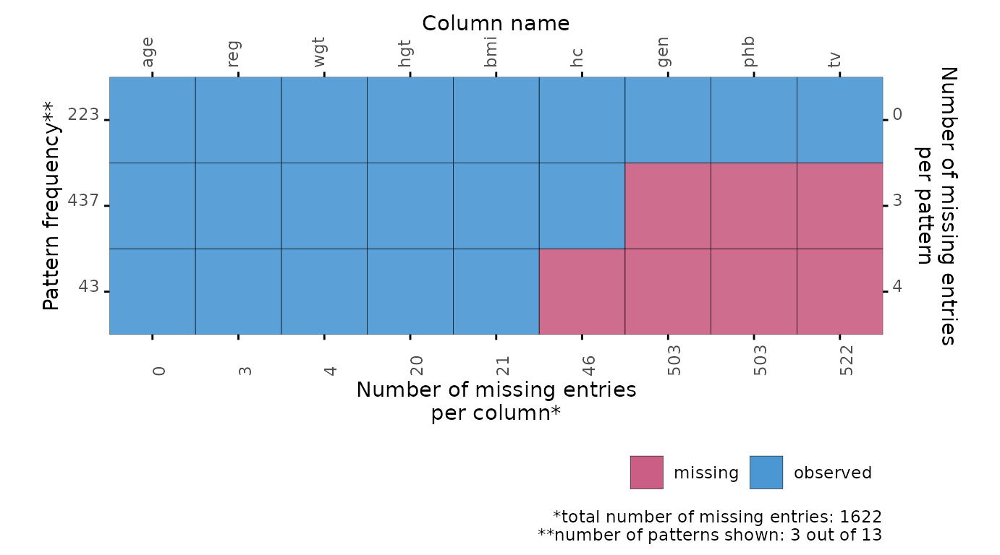
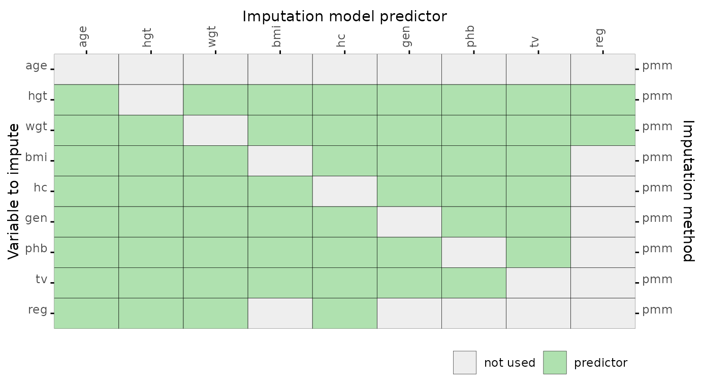

# Get started

## The `ggmice` package

The `ggmice` package provides visualizations for the evaluation of
incomplete data, `mice` imputation model arguments, and multiply imputed
data sets ([`mice::mids`](https://amices.org/mice/reference/mids.html)
objects). The functions in `ggmice` adhere to the ‘grammar of graphics’
philosophy, popularized by the `ggplot2` package. With that, `ggmice`
enhances imputation workflows and provides plotting objects that are
easily extended and manipulated by each individual ‘imputer’.

This vignette gives an overview of the different plotting function in
`ggmice`. The core function,
[`ggmice()`](http://amices.org/ggmice/reference/ggmice.md), is a
[`ggplot2::ggplot()`](https://ggplot2.tidyverse.org/reference/ggplot.html)
wrapper function which handles missing and imputed values. In this
vignette, you’ll learn how to create and interpret `ggmice`
visualizations.

Experienced `mice` users may already be familiar with the `lattice`
style plotting functions in `mice`. These ‘old friends’ such as
[`mice::bwplot()`](https://rdrr.io/pkg/lattice/man/xyplot.html) can be
re-created with the
[`ggmice()`](http://amices.org/ggmice/reference/ggmice.md) function, see
the [Old friends](https://amices.org/ggmice/articles/old_friends.html)
vignette for advice.

## Set-up

You can install the latest `ggmice` release from
[CRAN](https://CRAN.R-project.org/package=ggmice) with:

``` r
install.packages("ggmice")
```

The development version of the `ggmice` package can be installed from
GitHub with:

``` r
# install.packages("devtools")
devtools::install_github("amices/ggmice")
```

After installing `ggmice`, you can load the package into your `R`
workspace. It is highly recommended to load the `mice` and `ggplot2`
packages as well. This vignette assumes that all three packages are
loaded:

``` r
library(mice)
library(ggplot2)
library(ggmice)
```

We will use the
[`mice::boys`](https://amices.org/mice/reference/boys.html) data for
illustrations. This is an incomplete dataset ($n = 748$) with
cross-sectional data on $9$ growth-related variables (e.g., age in years
and height in cm).

We load the incomplete data with:

``` r
dat <- boys
```

For the purpose of this vignette, we impute all incomplete variables
$m = 3$ times with predictive mean matching as imputation method.
Imputations are generated with:

``` r
imp <- mice(dat, m = 3, method = "pmm")
```

We now have the necessary packages, an incomplete dataset (`dat`), and a
[`mice::mids`](https://amices.org/mice/reference/mids.html) object
(`imp`) loaded in our workspace.

## The `ggmice()` function

The core function in the `ggmice` package is
[`ggmice()`](http://amices.org/ggmice/reference/ggmice.md). This
function mimics how the `ggplot2` function
[`ggplot()`](https://ggplot2.tidyverse.org/reference/ggplot.html) works:
both take a `data` argument and a `mapping` argument, and will return an
object of class `ggplot`.

Using [`ggmice()`](http://amices.org/ggmice/reference/ggmice.md) looks
equivalent to a
[`ggplot()`](https://ggplot2.tidyverse.org/reference/ggplot.html) call:

``` r
ggplot(dat, aes(x = age))
ggmice(dat, aes(x = age))
```

The main difference between the two functions is that
[`ggmice()`](http://amices.org/ggmice/reference/ggmice.md) is actually a
wrapper around
[`ggplot()`](https://ggplot2.tidyverse.org/reference/ggplot.html),
including some pre-processing steps for incomplete and imputed data.
Because of the internal processing in
[`ggmice()`](http://amices.org/ggmice/reference/ggmice.md), the
`mapping` argument is *required* for each
[`ggmice()`](http://amices.org/ggmice/reference/ggmice.md) call. This is
in contrast to the aesthetic mapping in
[`ggplot()`](https://ggplot2.tidyverse.org/reference/ggplot.html), which
may also be provided in subsequent plotting layers. After creating a
`ggplot` object, any desired plotting layers may be added (e.g., with
the family of `ggplot2::geom_*` functions), or adjusted (e.g., with the
[`ggplot2::labs()`](https://ggplot2.tidyverse.org/reference/labs.html)
function). This makes
[`ggmice()`](http://amices.org/ggmice/reference/ggmice.md) a versatile
plotting function for incomplete and/or imputed data.

The object supplied to the `data` argument in
[`ggmice()`](http://amices.org/ggmice/reference/ggmice.md) should be an
incomplete dataset of class `data.frame`, or an imputation object of
class [`mice::mids`](https://amices.org/mice/reference/mids.html).
Depending on which one of these is provided, the resulting visualization
will either differentiate between observed and *missing* data, or
between observed and *imputed* data. By convention, observed data is
plotted in blue and missing or imputed data is plotted in red.

The `mapping` argument in
[`ggmice()`](http://amices.org/ggmice/reference/ggmice.md) cannot be
empty. An `x` or `y` mapping (or both) has to be supplied for
[`ggmice()`](http://amices.org/ggmice/reference/ggmice.md) to function.
This aesthetic mapping can be provided with the `ggplot2` function
[`aes()`](https://ggplot2.tidyverse.org/reference/aes.html) (or
equivalents). Other mapping may be provided too, except for `colour`,
which is already used to display observed versus missing or imputed
data.

### Incomplete data

If the object supplied to the `data` argument in
[`ggmice()`](http://amices.org/ggmice/reference/ggmice.md) is a
`data.frame`, the visualization will contain observed data in blue and
missing data in red. Since missing data points are by definition
unobserved, the values themselves cannot be plotted. What we *can* plot
are sets of variable pairs. Any missing values in one variable can be
displayed on the axis of the other. This provides a visual cue that the
missing data is distinct from the observed values, but still displays
the observed value of the other variable.

For example, the variable `age` is completely observed, while there are
some missing entries for the height variable `hgt`. We can create a
scatter plot of these two variables with:

``` r
ggmice(dat, aes(age, hgt)) +
  geom_point()
```


The `age` of cases with missing `hgt` are plotted on the horizontal
axis. This is in contrast to a regular
[`ggplot()`](https://ggplot2.tidyverse.org/reference/ggplot.html) call
with the same arguments, which would leave out all cases with missing
`hgt`. So, with
[`ggmice()`](http://amices.org/ggmice/reference/ggmice.md) we loose less
information, and may even gain valuable insight into the missingness in
the data.

Another example of
[`ggmice()`](http://amices.org/ggmice/reference/ggmice.md) in action on
incomplete data is when one of the variables is categorical. The
incomplete continuous variable `hgt` is plotted against the incomplete
categorical variable `reg` with:

``` r
ggmice(dat, aes(reg, hgt)) +
  geom_point()
```



Again, missing values are plotted on the axes. Cases with observed `hgt`
and missing `reg` are plotted on the vertical axis. Cases with observed
`reg` and missing `hgt` are plotted on the horizontal axis. There are no
cases were neither is observed, but otherwise these would be plotted on
the intersection of the two axes.

The ‘grammar of graphics’ makes it easy to adjust the plots
programmatically. For example, we could be interested in the differences
in growth data between the city and other regions. Add facets based on a
clustering variable with:

``` r
ggmice(dat, aes(wgt, hgt)) +
  geom_point() +
  facet_wrap(~ reg == "city", labeller = label_both)
```



Or, alternatively, we could convert the plotted values of the variable
`hgt` from centimeters to inches and the variable `wgt` from kilograms
to pounds with:

``` r
ggmice(dat, aes(wgt * 2.20, hgt / 2.54)) +
  geom_point() +
  labs(x = "Weight (lbs)", y = "Height (in)")
#> Warning: Mapping variable 'wgt * 2.2' recognized internally as wgt.
#> Please verify whether this matches the requested mapping variable.
#> Warning: Mapping variable 'hgt/2.54' recognized internally as hgt.
#> Please verify whether this matches the requested mapping variable.
```



A final example of
[`ggmice()`](http://amices.org/ggmice/reference/ggmice.md) applied to
incomplete data is faceting based on a missingness indicator. Doing so
may help explore the missingness mechanisms in the incomplete data. The
distribution of the continuous variable `age` and categorical variable
`reg` are visualized faceted by the missingness indicator for `hgt`
with:

``` r
# continuous variable
ggmice(dat, aes(age)) +
  geom_density() +
  facet_wrap(~ factor(is.na(hgt) == 0, labels = c("observed height", "missing height")))
```



``` r
# categorical variable
ggmice(dat, aes(reg)) +
  geom_bar(fill = "white") +
  facet_wrap(~ factor(is.na(hgt) == 0, labels = c("observed height", "missing height")))
```



### Imputed data

If the `data` argument in
[`ggmice()`](http://amices.org/ggmice/reference/ggmice.md) is provided a
[`mice::mids`](https://amices.org/mice/reference/mids.html) object, the
resulting plot will contain observed data in blue and imputed data in
red. There are many possible visualizations for imputed data, four of
which are explicitly defined in the `mice` package. Each of these can be
re-created with the
[`ggmice()`](http://amices.org/ggmice/reference/ggmice.md) function (see
the [Old friends](https://amices.org/ggmice/articles/old_friends.html)
vignette). But
[`ggmice()`](http://amices.org/ggmice/reference/ggmice.md) can do even
more.

For example, we could create the same scatter plots as the ones above,
but now on the imputed data:

``` r
ggmice(imp, aes(age, hgt)) +
  geom_point()
```


``` r
ggmice(imp, aes(reg, hgt)) +
  geom_point()
```



``` r
ggmice(imp, aes(wgt, hgt)) +
  geom_point() +
  facet_wrap(~ reg == "city", labeller = label_both)
```


``` r
ggmice(imp, aes(wgt * 2.20, hgt / 2.54)) +
  geom_point() +
  labs(x = "Weight (lbs)", y = "Height (in)")
#> Warning: Mapping variable 'wgt * 2.2' recognized internally as wgt.
#> Please verify whether this matches the requested mapping variable.
#> Warning: Mapping variable 'hgt/2.54' recognized internally as hgt.
#> Please verify whether this matches the requested mapping variable.
```


These figures show the observed data points once in blue, plus three
imputed values in red for each missing entry.

It is also possible to use the imputation number as mapping variable in
the plot. For example, we can create a stripplot of observed and imputed
data with the imputation number `.imp` on the horizontal axis:

``` r
ggmice(imp, aes(x = .imp, y = hgt)) +
  geom_jitter(height = 0, width = 0.25) +
  labs(x = "Imputation number")
```


A major advantage of
[`ggmice()`](http://amices.org/ggmice/reference/ggmice.md) over the
equivalent function
[`mice::stripplot()`](https://rdrr.io/pkg/lattice/man/xyplot.html) is
that `ggmice` allows us to add subsequent plotting layers, such as a
boxplot overlay:

``` r
ggmice(imp, aes(x = .imp, y = hgt)) +
  geom_jitter(height = 0, width = 0.25) +
  geom_boxplot(width = 0.5, linewidth = 1, alpha = 0.75, outlier.shape = NA) +
  labs(x = "Imputation number")
```



You may want to create a plot visualizing the imputations of multiple
variables as one object. This can be done by combining `ggmice` with the
functional programming package `purrr` and visualization package
`patchwork`. For example, we could obtain boxplots of different imputed
variables as one object using:

``` r
purrr::map(c("wgt", "hgt", "bmi"), ~ {
  ggmice(imp, aes(x = .imp, y = .data[[.x]])) +
    geom_boxplot() +
    labs(x = "Imputation number")
}) %>%
  patchwork::wrap_plots()
```



To re-create any `mice` plot with `ggmice`, see the [Old
friends](https://amices.org/ggmice/articles/old_friends.html) vignette.

## Other functions

The `ggmice` package contains some additional plotting functions to
explore incomplete data and evaluate convergence of the imputation
algorithm. These are presented in the order of a typical imputation
workflow, where the missingness is first investigated using a missing
data pattern and influx-outflux plot, then imputation models are built
based on relations between variables, and finally the imputations are
inspected visually to check for non-convergence.

### Missing data pattern

The
[`plot_pattern()`](http://amices.org/ggmice/reference/plot_pattern.md)
function displays the missing data pattern in an incomplete dataset. The
argument `data` (the incomplete dataset) is required, the argument
`square` is optional and determines whether the missing data pattern has
square or rectangular tiles, and the optional argument `rotate` changes
the angle of the variable names 90 degrees if requested. Other optional
arguments are `cluster` and `npat`.

``` r
# create missing data pattern plot
plot_pattern(dat)
```


``` r

# specify optional arguments
plot_pattern(
  dat,
  square = TRUE,
  rotate = TRUE,
  npat = 3,
  cluster = "reg"
)
```



### Influx and outflux

The [`plot_flux()`](http://amices.org/ggmice/reference/plot_flux.md)
function produces an influx-outflux plot. The influx of a variable
quantifies how well its missing data connect to the observed data on
other variables. The outflux of a variable quantifies how well its
observed data connect to the missing data on other variables. In
general, higher influx and outflux values are preferred when building
imputation models. The plotting function requires an incomplete dataset
(argument `data`), and takes optional arguments to adjust the legend and
axis labels.

``` r
# create influx-outflux plot
plot_flux(dat)
```


``` r

# specify optional arguments
plot_flux(
  dat,
  label = FALSE,
  caption = FALSE
)
```


### Correlations between variables

The function
[`plot_corr()`](http://amices.org/ggmice/reference/plot_corr.md) can be
used to investigate relations between variables, for the development of
imputation models. Only one of the arguments (`data`, the incomplete
dataset) is required, all other arguments are optional.

``` r
# create correlation plot
plot_corr(dat)
```


``` r

# specify optional arguments
plot_corr(
  dat,
  vrb = c("hgt", "wgt", "bmi"),
  label = TRUE,
  square = FALSE,
  diagonal = TRUE,
  rotate = TRUE
)
```


### Predictor matrix

The function
[`plot_pred()`](http://amices.org/ggmice/reference/plot_pred.md)
displays `mice` predictor matrices. A predictor matrix is typically
created using
[`mice::make.predictorMatrix()`](https://amices.org/mice/reference/make.predictorMatrix.html),
[`mice::quickpred()`](https://amices.org/mice/reference/quickpred.html),
or by using the default in
[`mice::mice()`](https://amices.org/mice/reference/mice.html) and
extracting the `predictorMatrix` from the resulting `mids` object. The
[`plot_pred()`](http://amices.org/ggmice/reference/plot_pred.md)
function requires a predictor matrix (the `data` argument), but other
arguments can be provided too.

``` r
# create predictor matrix
pred <- quickpred(dat)

# create predictor matrix plot
plot_pred(pred)
#> Ignoring unknown labels:
#> • colour : ""
```


``` r

# specify optional arguments
plot_pred(
  pred,
  label = FALSE,
  square = FALSE,
  rotate = TRUE,
  method = "pmm"
)
#> Ignoring unknown labels:
#> • colour : ""
```



### Algorithmic convergence

The function
[`plot_trace()`](http://amices.org/ggmice/reference/plot_trace.md) plots
the trace lines of the MICE algorithm for convergence evaluation. The
only required argument is `data` (to supply a
[`mice::mids`](https://amices.org/mice/reference/mids.html) object). The
optional argument `vrb` defaults to `"all"`, which would display
traceplots for all variables.

``` r
# create traceplot for one variable
plot_trace(imp, "hgt")
```


------------------------------------------------------------------------

## 

This is the end of the vignette. This document was generated using:

``` r
sessionInfo()
#> R version 4.5.2 (2025-10-31)
#> Platform: x86_64-pc-linux-gnu
#> Running under: Ubuntu 24.04.3 LTS
#> 
#> Matrix products: default
#> BLAS:   /usr/lib/x86_64-linux-gnu/openblas-pthread/libblas.so.3 
#> LAPACK: /usr/lib/x86_64-linux-gnu/openblas-pthread/libopenblasp-r0.3.26.so;  LAPACK version 3.12.0
#> 
#> locale:
#>  [1] LC_CTYPE=C.UTF-8       LC_NUMERIC=C           LC_TIME=C.UTF-8       
#>  [4] LC_COLLATE=C.UTF-8     LC_MONETARY=C.UTF-8    LC_MESSAGES=C.UTF-8   
#>  [7] LC_PAPER=C.UTF-8       LC_NAME=C              LC_ADDRESS=C          
#> [10] LC_TELEPHONE=C         LC_MEASUREMENT=C.UTF-8 LC_IDENTIFICATION=C   
#> 
#> time zone: UTC
#> tzcode source: system (glibc)
#> 
#> attached base packages:
#> [1] stats     graphics  grDevices utils     datasets  methods   base     
#> 
#> other attached packages:
#> [1] ggmice_0.1.1.9000 ggplot2_4.0.1     mice_3.19.0      
#> 
#> loaded via a namespace (and not attached):
#>  [1] gtable_0.3.6       shape_1.4.6.1      xfun_0.55          bslib_0.9.0       
#>  [5] htmlwidgets_1.6.4  lattice_0.22-7     vctrs_0.6.5        tools_4.5.2       
#>  [9] Rdpack_2.6.4       generics_0.1.4     tibble_3.3.0       pan_1.9           
#> [13] pkgconfig_2.0.3    jomo_2.7-6         Matrix_1.7-4       RColorBrewer_1.1-3
#> [17] S7_0.2.1           desc_1.4.3         lifecycle_1.0.4    compiler_4.5.2    
#> [21] farver_2.1.2       stringr_1.6.0      textshaping_1.0.4  codetools_0.2-20  
#> [25] htmltools_0.5.9    sass_0.4.10        yaml_2.3.12        glmnet_4.1-10     
#> [29] pillar_1.11.1      pkgdown_2.2.0      nloptr_2.2.1       jquerylib_0.1.4   
#> [33] tidyr_1.3.2        MASS_7.3-65        cachem_1.1.0       reformulas_0.4.3  
#> [37] iterators_1.0.14   rpart_4.1.24       boot_1.3-32        foreach_1.5.2     
#> [41] mitml_0.4-5        nlme_3.1-168       tidyselect_1.2.1   digest_0.6.39     
#> [45] stringi_1.8.7      dplyr_1.1.4        purrr_1.2.0        labeling_0.4.3    
#> [49] splines_4.5.2      fastmap_1.2.0      grid_4.5.2         cli_3.6.5         
#> [53] magrittr_2.0.4     patchwork_1.3.2    survival_3.8-3     broom_1.0.11      
#> [57] withr_3.0.2        scales_1.4.0       backports_1.5.0    rmarkdown_2.30    
#> [61] otel_0.2.0         nnet_7.3-20        lme4_1.1-38        ragg_1.5.0        
#> [65] evaluate_1.0.5     knitr_1.51         rbibutils_2.4      rlang_1.1.6       
#> [69] Rcpp_1.1.0         glue_1.8.0         minqa_1.2.8        jsonlite_2.0.0    
#> [73] R6_2.6.1           systemfonts_1.3.1  fs_1.6.6
```
