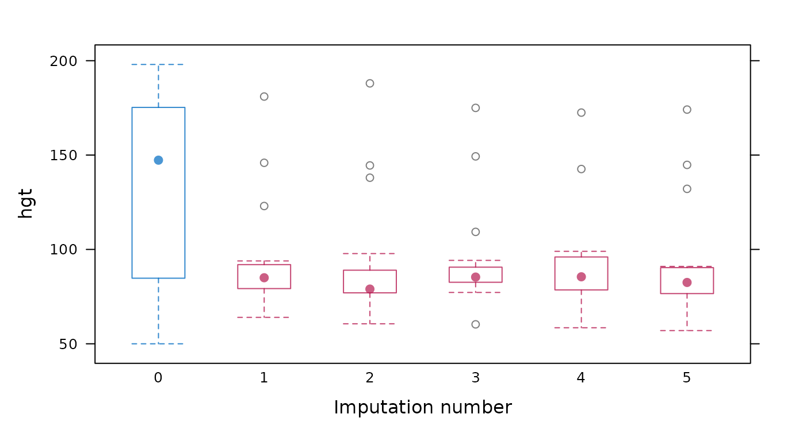
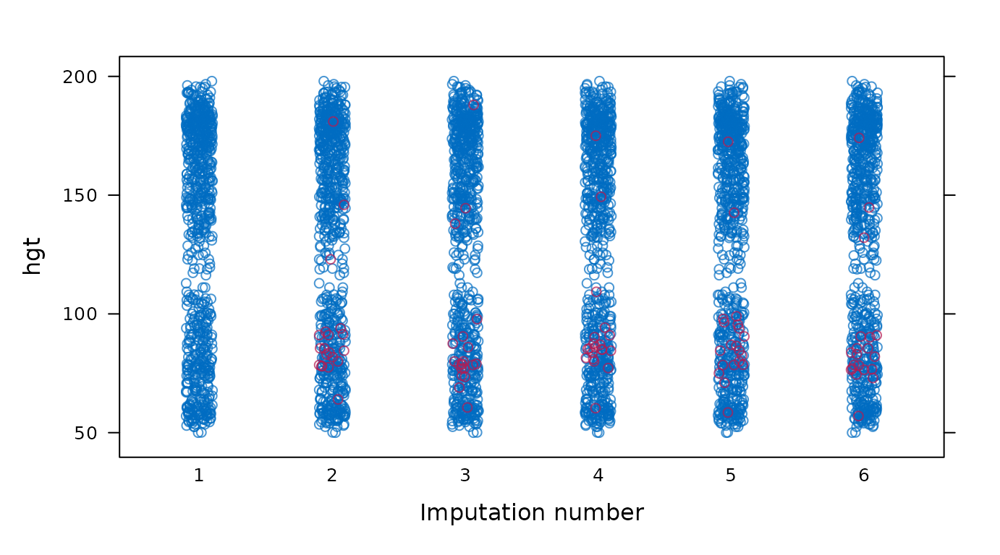
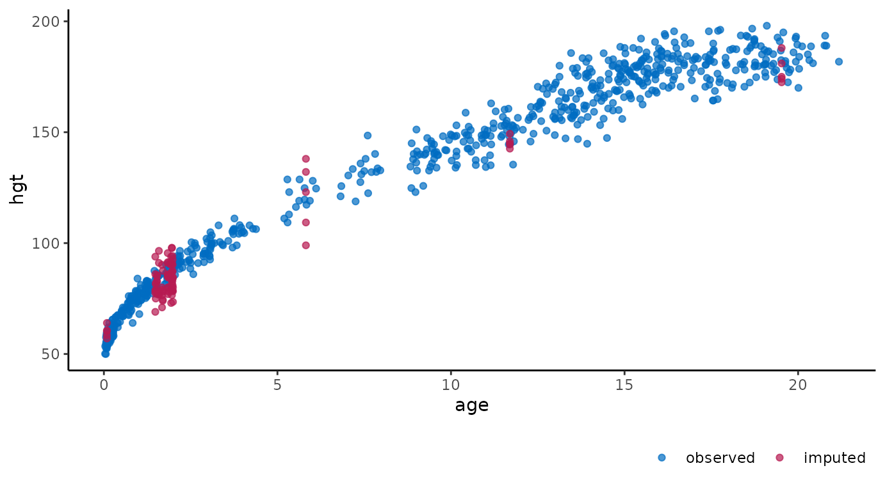

# Old friends

## Create the `ggmice` equivalent of `mice` plots

How to re-create the output of the plotting functions from `mice` with
`ggmice`. In alphabetical order of the `mice` functions.

First load the `ggmice`, `mice`, and `ggplot2` packages, some incomplete
data and a `mids` object into your workspace.

``` r
# load packages
library(ggmice)
library(mice)
library(ggplot2)
# load incomplete dataset from mice
dat <- boys
# generate imputations
imp <- mice(dat, method = "pmm", printFlag = FALSE)
```

## `bwplot`

Box-and-whisker plot of observed and imputed data.

``` r
# original plot
mice::bwplot(imp, hgt ~ .imp)
```



``` r
# ggmice equivalent
ggmice(imp, aes(x = .imp, y = hgt)) +
  geom_boxplot() +
  labs(x = "Imputation number")
```


``` r
# extended reproduction with ggmice
ggmice(imp, aes(x = .imp, y = hgt)) +
  stat_boxplot(geom = "errorbar", linetype = "dashed") +
  geom_boxplot(outlier.colour = "grey", outlier.shape = 1) +
  labs(x = "Imputation number") +
  theme(legend.position = "none")
```


## `densityplot`

Density plot of observed and imputed data.

``` r
# original plot
mice::densityplot(imp, ~hgt)
```


``` r
# ggmice equivalent
ggmice(imp, aes(x = hgt, group = .imp)) +
  geom_density()
```


``` r
# extended reproduction with ggmice
ggmice(imp, aes(x = hgt, group = .imp, linewidth = .where)) +
  geom_density() +
  scale_linewidth_manual(
    values = c("observed" = 1, "imputed" = 0.5),
    guide = "none"
  ) +
  theme(legend.position = "none")
```


## `fluxplot`

Influx and outflux plot of multivariate missing data patterns.

``` r
# original plot
fluxplot(dat)
```


``` r
# ggmice equivalent
plot_flux(dat)
```


## `md.pattern`

Missing data pattern plot.

``` r
# original plot
md <- md.pattern(dat)
```


``` r
# ggmice equivalent
plot_pattern(dat)
```


``` r
# extended reproduction with ggmice
plot_pattern(dat, square = TRUE) +
  theme(
    legend.position = "none",
    axis.title = element_blank(),
    axis.title.x.top = element_blank(),
    axis.title.y.right = element_blank()
  )
```


## `plot.mids`

Plot the trace lines of the MICE algorithm.

``` r
# original plot
plot(imp, hgt ~ .it | .ms)
```


``` r
# ggmice equivalent
plot_trace(imp, "hgt")
```


## `stripplot`

Stripplot of observed and imputed data.

``` r
# original plot
mice::stripplot(imp, hgt ~ .imp)
```



``` r
# ggmice equivalent
ggmice(imp, aes(x = .imp, y = hgt)) +
  geom_jitter(width = 0.25) +
  labs(x = "Imputation number")
```


``` r
# extended reproduction with ggmice (not recommended)
ggmice(imp, aes(x = .imp, y = hgt)) +
  geom_jitter(
    shape = 1,
    width = 0.1,
    na.rm = TRUE,
    data = data.frame(
      hgt = dat$hgt,
      .imp = factor(rep(1:imp$m, each = nrow(dat))),
      .where = "observed"
    )
  ) +
  geom_jitter(shape = 1, width = 0.1) +
  labs(x = "Imputation number") +
  theme(legend.position = "none")
```


## `xyplot`

Scatterplot of observed and imputed data.

``` r
# original plot
mice::xyplot(imp, hgt ~ age)
```


``` r
# ggmice equivalent
ggmice(imp, aes(age, hgt)) +
  geom_point()
```



``` r
# extended reproduction with ggmice
ggmice(imp, aes(age, hgt)) +
  geom_point(size = 2, shape = 1) +
  theme(legend.position = "none")
```


## Extensions

### Interactive plots

To make `ggmice` visualizations interactive, the `plotly` package can be
used. For example, an interactive influx and outflux plot may be more
legible than a static one.

``` r
# load packages
library(plotly)
# influx and outflux plot
p <- plot_flux(dat)
ggplotly(p)
```

### Plot multiple variables

You may want to create a plot visualizing the imputations of multiple
variables as one object. To visualize multiple variables at once, the
variable names are saved in a vector. This vector is used together with
the functional programming package `purrr` and visualization package
`patchwork` to [`map()`](https://purrr.tidyverse.org/reference/map.html)
over the variables and subsequently `wrap_plots` to create a single
figure.

``` r
# load packages
library(purrr)
library(patchwork)
# create vector with variable names
vrb <- names(dat)
```

Display box-and-whisker plots for all variables.

``` r
# original plot
mice::bwplot(imp)
```


``` r
# ggmice equivalent
p <- map(vrb, ~ {
  ggmice(imp, aes(x = .imp, y = .data[[.x]])) +
    geom_boxplot() +
    scale_x_discrete(drop = FALSE) +
    labs(x = "Imputation number")
})
wrap_plots(p, guides = "collect") &
  theme(legend.position = "bottom")
```


Display density plots for all variables.

``` r
# original plot
mice::densityplot(imp)
```


``` r
# ggmice equivalent
p <- map(vrb, ~ {
  ggmice(imp, aes(x = .data[[.x]], group = .imp)) +
    geom_density()
})
wrap_plots(p, guides = "collect") &
  theme(legend.position = "bottom")
```


Display strip plots for all variables.

``` r
# original plot
mice::stripplot(imp)
```


``` r
# ggmice equivalent
p <- map(vrb, ~ {
  ggmice(imp, aes(x = .imp, y = .data[[.x]])) +
    geom_jitter() +
    labs(x = "Imputation number")
})
wrap_plots(p, guides = "collect") &
  theme(legend.position = "bottom")
```


------------------------------------------------------------------------

## 

This is the end of the vignette. This document was generated using:

``` r
sessionInfo()
#> R version 4.5.2 (2025-10-31)
#> Platform: x86_64-pc-linux-gnu
#> Running under: Ubuntu 24.04.3 LTS
#> 
#> Matrix products: default
#> BLAS:   /usr/lib/x86_64-linux-gnu/openblas-pthread/libblas.so.3 
#> LAPACK: /usr/lib/x86_64-linux-gnu/openblas-pthread/libopenblasp-r0.3.26.so;  LAPACK version 3.12.0
#> 
#> locale:
#>  [1] LC_CTYPE=C.UTF-8       LC_NUMERIC=C           LC_TIME=C.UTF-8       
#>  [4] LC_COLLATE=C.UTF-8     LC_MONETARY=C.UTF-8    LC_MESSAGES=C.UTF-8   
#>  [7] LC_PAPER=C.UTF-8       LC_NAME=C              LC_ADDRESS=C          
#> [10] LC_TELEPHONE=C         LC_MEASUREMENT=C.UTF-8 LC_IDENTIFICATION=C   
#> 
#> time zone: UTC
#> tzcode source: system (glibc)
#> 
#> attached base packages:
#> [1] stats     graphics  grDevices utils     datasets  methods   base     
#> 
#> other attached packages:
#> [1] patchwork_1.3.2   purrr_1.2.0       plotly_4.11.0     ggplot2_4.0.1    
#> [5] mice_3.19.0       ggmice_0.1.1.9000
#> 
#> loaded via a namespace (and not attached):
#>  [1] gtable_0.3.6       shape_1.4.6.1      xfun_0.55          bslib_0.9.0       
#>  [5] htmlwidgets_1.6.4  lattice_0.22-7     crosstalk_1.2.2    vctrs_0.6.5       
#>  [9] tools_4.5.2        Rdpack_2.6.4       generics_0.1.4     tibble_3.3.0      
#> [13] pan_1.9            pkgconfig_2.0.3    jomo_2.7-6         Matrix_1.7-4      
#> [17] data.table_1.18.0  RColorBrewer_1.1-3 S7_0.2.1           desc_1.4.3        
#> [21] lifecycle_1.0.4    compiler_4.5.2     farver_2.1.2       stringr_1.6.0     
#> [25] textshaping_1.0.4  codetools_0.2-20   htmltools_0.5.9    sass_0.4.10       
#> [29] lazyeval_0.2.2     yaml_2.3.12        glmnet_4.1-10      pillar_1.11.1     
#> [33] pkgdown_2.2.0      nloptr_2.2.1       jquerylib_0.1.4    tidyr_1.3.2       
#> [37] MASS_7.3-65        cachem_1.1.0       reformulas_0.4.3   iterators_1.0.14  
#> [41] rpart_4.1.24       boot_1.3-32        foreach_1.5.2      mitml_0.4-5       
#> [45] nlme_3.1-168       tidyselect_1.2.1   digest_0.6.39      stringi_1.8.7     
#> [49] dplyr_1.1.4        labeling_0.4.3     splines_4.5.2      fastmap_1.2.0     
#> [53] grid_4.5.2         cli_3.6.5          magrittr_2.0.4     survival_3.8-3    
#> [57] broom_1.0.11       withr_3.0.2        scales_1.4.0       backports_1.5.0   
#> [61] httr_1.4.7         rmarkdown_2.30     otel_0.2.0         nnet_7.3-20       
#> [65] lme4_1.1-38        ragg_1.5.0         evaluate_1.0.5     knitr_1.51        
#> [69] rbibutils_2.4      viridisLite_0.4.2  rlang_1.1.6        Rcpp_1.1.0        
#> [73] glue_1.8.0         minqa_1.2.8        jsonlite_2.0.0     R6_2.6.1          
#> [77] systemfonts_1.3.1  fs_1.6.6
```
